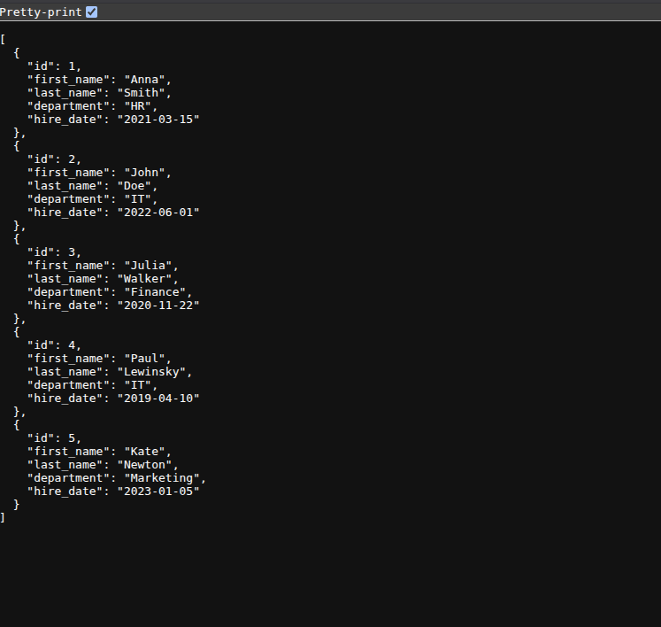
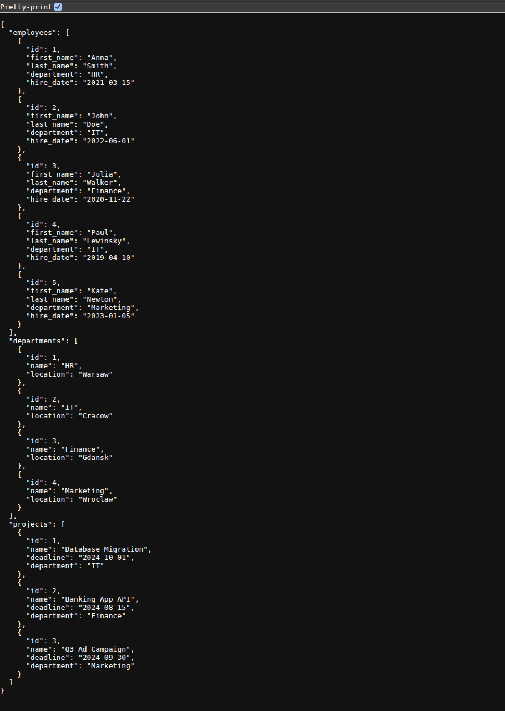

# 🐳 Docker SQL Gateway

A lightweight, containerized REST API built with **Python (BaseHTTPRequestHandler)** and **PostgreSQL**.

This project demonstrates a low-level implementation of a Client-Server architecture. Instead of using high-level frameworks like Flask, it handles raw HTTP requests and manages database connections via **ODBC drivers**, running entirely within **Docker Compose**.

## 📸 API Interface

### 1. Schema Discovery (`/tables`)
The API dynamically inspects the database schema to list available tables.


### 2. Specific Data Fetching (`/rows/employees`)
Fetching data from a specific table with automatic column mapping.


### 3. Full Database Dump (`/rows`)
Retrieves all data from all tables in a single nested JSON response.


## 🚀 Key Features
* **Containerized Architecture:** Orchestrates Python App and PostgreSQL DB using Docker Compose.
* **Raw HTTP Handling:** Implements `BaseHTTPRequestHandler` without web frameworks.
* **ODBC Connectivity:** Uses `pyodbc` and `unixodbc` to execute raw SQL queries.
* **Dynamic Querying:** Endpoints adapt to the database structure automatically.

## 🛠️ Tech Stack
* **Language:** Python 3.12
* **Database:** PostgreSQL 15
* **Infrastructure:** Docker & Docker Compose
* **Drivers:** `pyodbc`, `libpq-dev`

## 💻 How to Run

1.  **Clone the repository**
    ```bash
    git clone [https://github.com/Jahgodka/docker-sql-gateway.git](https://github.com/Jahgodka/docker-sql-gateway.git)
    cd docker-sql-gateway
    ```

2.  **Start with Docker Compose**
    ```bash
    docker-compose up --build
    ```
    *Note: The app waits 5 seconds for the database to initialize.*

3.  **Explore the API**
    Open your browser (or use Postman/curl):
    * List tables: `http://localhost:8080/tables`
    * Get employees: `http://localhost:8080/rows/employees`
    * Get schema info: `http://localhost:8080/columns`
